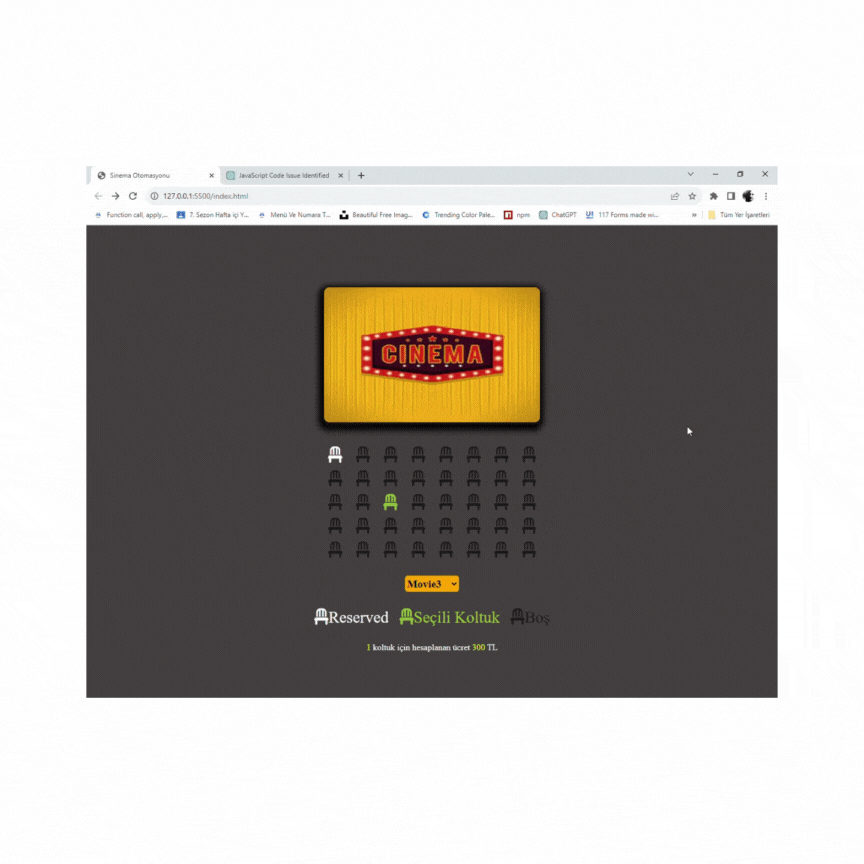

# Sinema Koltuk Rezervasyon Uygulaması

Bu uygulama, bir sinema salonunda koltuk rezervasyonunu simüle etmek için JavaScript kullanılarak geliştirilmiştir. Kullanıcılar film seçebilir ve boş koltukları seçebilirler.

## Nasıl Kullanılır

1. Uygulamayı başlatın ve bir film seçin.
2. Boş koltukları tıklayarak rezerve edin.
3. Seçtiğiniz koltukları görsel olarak işaretleyebilirsiniz.
4. Seçtiğiniz koltuk sayısı ve toplam ücret otomatik olarak hesaplanır.

## Kod Özeti

Bu uygulama, HTML, CSS ve JavaScript kullanılarak geliştirilmiştir. İşlevleri ve özellikleri şunlardır:

- Boş koltukların listesi alınır.
- Kullanıcılar koltukları seçebilir ve seçilen koltuklar "selected" sınıfı ile işaretlenir.
- Kullanıcıların seçtikleri koltuk sayısı ve toplam ücret hesaplanır.
- Kullanıcı tercihlerini yerel depolama (local storage) kullanarak kaydedebilirler.

